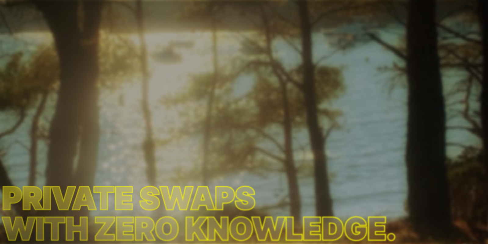

# What is ZeroSwaps?

ZeroSwaps is a decentralized exchange (DEX) that uses zero-knowledge proofs (zk-SNARKs) to ensure complete privacy of your transactions. Unlike traditional DEXs, ZeroSwaps allows you to swap tokens without revealing your transaction details, wallet addresses, or amounts to anyone.

The evolution of decentralized exchanges has reached a critical point where privacy is no longer optional. While existing DEXs have matured in their core functionality, they expose every transaction detail to public scrutiny. ZeroSwaps is engineered from first principles to solve this challenge, delivering complete transaction privacy without compromising the foundational tenets of decentralization, security, and permissionless access.

## Key features

ZeroSwaps provides a comprehensive suite of privacy-focused trading capabilities:

**Complete Privacy**: Your transactions are hidden using zk-SNARK technology, ensuring no transaction details are visible on-chain.

**Zero Platform Fees**: No fees charged by the platform, you only pay network gas fees.

**100+ Tokens**: Support for a wide range of ERC-20 tokens across multiple networks.

**256-bit Encryption**: Military-grade security for all transactions and data.

**Non-Custodial**: You maintain full control of your funds at all times, with no intermediaries.

## Quick start

Get started with ZeroSwaps in five simple steps:

1. Connect your wallet (MetaMask, WalletConnect, or any compatible wallet)
2. Select the tokens you want to swap from the dropdown menus
3. Enter the amount you wish to swap
4. Enable Privacy Mode for anonymous transactions
5. Confirm the swap in your wallet

The entire process takes less than a minute, and your transaction details remain completely private when Privacy Mode is enabled.

